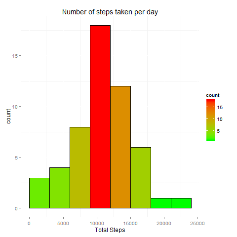
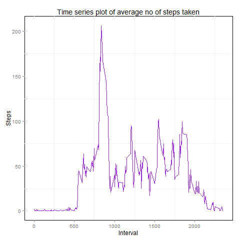
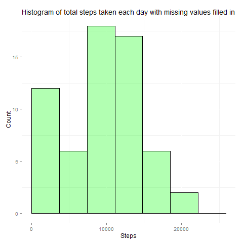
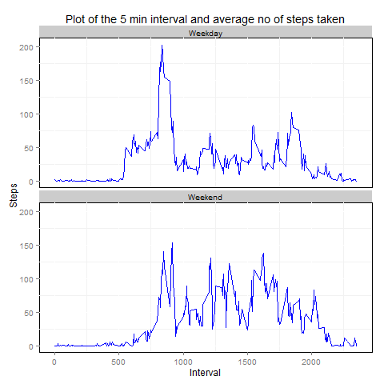

 Peer Assesment 1
===================

## INTRODUCTION

This assignment makes use of data from a personal activity monitoring device. This device collects data at 5 minute intervals through out the day. The data consists of two months of data from an anonymous individual collected during the months of October and November, 2012 and include the number of steps taken in 5 minute intervals each day.

## Loading and preprocessing the data 

Loading the required libraries

```{r,warning=FALSE}
library(ggplot2)
library(colorspace)
library(mice)
library(lubridate)
```


Reading the dataset and converting date into Date object

```{r,results='hide'}
activity = read.csv("activity.csv",stringsAsFactors=FALSE)
class(activity$date)
activity$date = as.Date(activity$date)
```

Converting the intervals into (HH:MM) format

```{r}
interval = activity$interval
convert = sprintf("%04d",interval)
activity$interval = convert
```

## What is mean total number of steps taken per day?

Calculating the total steps taken per day

```{r}
total_steps = aggregate(steps~date,data=activity,sum)
```

making the histogram of the total steps taken per day

```{r}
g = ggplot(total_steps,aes(total_steps$steps))
g + geom_histogram(breaks = seq(0,25000,by=3000),col="black", aes(fill=..count..)) + scale_fill_gradient("count",low="green",high="red")+
labs(x="Total Steps" , title = "Number of steps taken per day") + theme(panel.background = element_rect(fill="white"))
```

 
Calculating and reporting the mean and median number of total steps taken each day

```{r}
mean = round(mean(total_steps$steps))
mean 
median = round(median(total_steps$steps))
median
```

* Mean of total steps taken each day is = 10766
* Median of total steps taken each day is = 10765

## What is the average daily activity pattern?

Making a time series plot of the 5-minute interval (x-axis) and the average number of steps taken, averaged across all days (y-axis)

```{r,results='hide'}
daily_pattern = aggregate(activity$steps,by=list(activity$interval),mean,na.rm=TRUE)
colnames(daily_pattern) = c("interval","steps")
class(daily_pattern$interval)
daily_pattern$interval = as.integer(daily_pattern$interval)
g = ggplot()
g+geom_line(data = daily_pattern,aes(x=interval,y=steps),col="purple") +
labs(x="Interval",y="Steps",title="Time series plot of average no of steps taken") + theme(panel.background = element_rect(fill = "white", colour = "black"))
```


Determining the 5 min interval that contains the maximum number of steps

```{r}
which.max(daily_pattern$steps)
daily_pattern[104,]
```

**0835** is the 5 min interval that contains the maximum number of steps

## Imputing missing values

Calculating and reporting the missing values in the dataset
```{r}
summary(activity)
```
There are **2304** missing rows in the dataset

### Strategy for imputing missing data

We'll use multiple imputation to fill in the missing values
**Multiple imputation ** is a method in which We can fill in missing values based on the non missing values for an observation.
Multiple imputation will in general result in different missing values being filled in based on the random seed that
is set.We will use multiple imputation through pre-existing R libraries.
We create a new dataframe containing only 2 variables - steps and interval and then we use the function complete on the function mice.
5 rounds of imputation will be run and all the missing data will be filled in .


```{r}
set.seed(144)
simple = activity[c("steps","interval")]
imputed = complete(mice(simple))
```

Imputed is our new dataset with missing values filled in
```{r}
imputed$date = activity$date
```
making a histogram of total steps taken each day
```{r}
steps = aggregate(steps~date,data=imputed,sum)
g = ggplot(steps,aes(steps))
g + geom_histogram(breaks=seq(0,27000,3700),col="black",fill="green",alpha=0.3)+
labs(x="Steps",y="Count",title="Histogram of total steps taken each day with missing values filled in") + theme(panel.background = element_rect(fill = "white"))
```


Recalculating the mean and median total steps per day
```{r}
mean2 = round(mean(steps$steps))
mean2
median2 = round(median(steps$steps))
median2
```

impact of imputing missing data on the estimates of the total daily number of steps:
 - mean decreased from **10766** to **9354** and the median decreased from **10765** to **10395**.

## Are there differences in activity patterns between weekdays and weekends?

Create a new factor variable in the dataset with two levels - "weekday" and "weekend"
```{r}
imputed$day_of_week = weekdays(imputed$date)
imputed$day_of_week[imputed$day_of_week == "Monday"] = "Weekday"
imputed$day_of_week[imputed$day_of_week == "Tuesday"] = "Weekday"
imputed$day_of_week[imputed$day_of_week == "Wednesday"] = "Weekday"
imputed$day_of_week[imputed$day_of_week == "Thursday"] = "Weekday"
imputed$day_of_week[imputed$day_of_week == "Friday"] = "Weekday"
imputed$day_of_week[imputed$day_of_week == "Saturday"] = "Weekend"
imputed$day_of_week[imputed$day_of_week == "Sunday"] = "Weekend"
```

Make a panel plot containing a time series plot of the 5-minute interval (x-axis) and the average number of steps taken, averaged across all weekday days or weekend days (y-axis). 

```{r,results='hide'}
avg = aggregate(imputed$steps,by=list(imputed$interval,imputed$day_of_week),mean)
colnames(avg) = c("interval","day_of_week","steps")
class(avg$steps)
class(avg$interval)
avg$interval = as.numeric(avg$interval)
```
```{r}
g = ggplot()
g + geom_line(data=avg , aes(interval,steps), col = "blue") + facet_wrap(~day_of_week,nrow=2,ncol=1) +
theme(panel.background = element_rect(fill = "white", colour = "black")) + labs(x="Interval",y="Steps",title="Plot of the 5 min interval and average no of steps taken")
```
